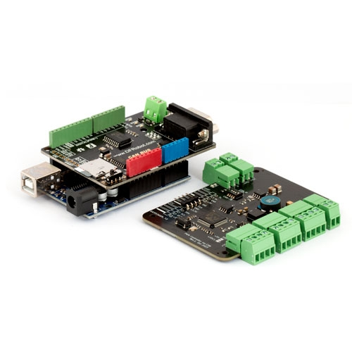

## SMC-00X Series
Updated on 24.01.04

### SMC-001

<a href="https://www.motorbank.kr/goods/goods_list.php?cateCd=066">구매 및 메뉴얼 바로가기</a>
  
**문의하기**: clare<k>.robotmart@gmail.com

### Description
SMC-001 보드를 Arduino Uno 및 DFR CAN Shield를 이용하여 제어하는 예제코드 모음.  
* Mode 0: 펄스기반 위치제어
* Mode 1: 지속 회전 속도제어
* Mode 2: 엔코더 기반 위치제어

### CAN Header File 준비
DFR CAN Shield 제공 라이브러리 [다운로드][1] or "mcp_can" 폴더 사용.  
"mcp_can" 폴더는 /Documents/Aruduino/libraries 폴더 내에 넣어놓기.

[1]:https://wiki.dfrobot.com/CAN-BUS_Shield_V2__SKU__DFR0370_#More

